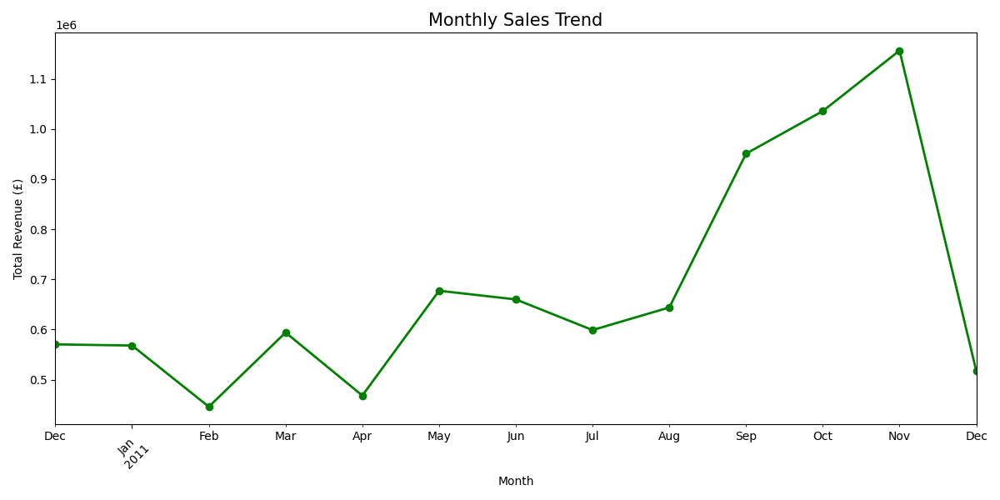
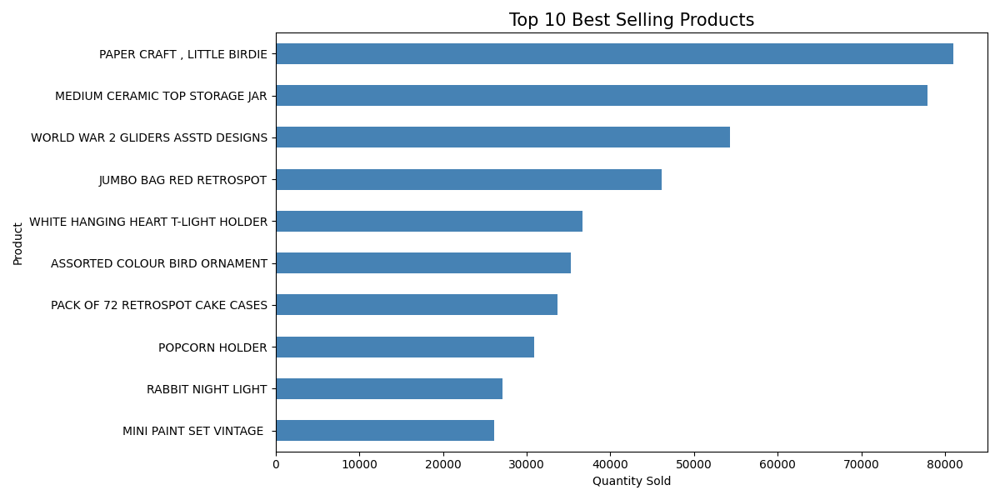

# E-Commerce Sales Intelligence
An Exploratory Data Analysis (EDA) project focused on cleaning and transforming 10,000+ rows of raw retail data to track Revenue, Profit Margins, and regional KPIs.

## 📊 Project Highlights
* **Data Intelligence:** Orchestrated the cleaning and transformation of 10,000+ rows of raw retail data, reducing redundancy by 15%.
* **Sales Trends:** Analyzed purchasing patterns to identify the top highest-grossing categories and customer trends.
* **Visual Insights:** Created visualization suites to monitor performance and identify waste reduction opportunities.

## 🛠 Tech Stack
* **Python** (Pandas, NumPy, Matplotlib, Seaborn)
* **Jupyter Notebook**

## 📈 Key Visualizations

